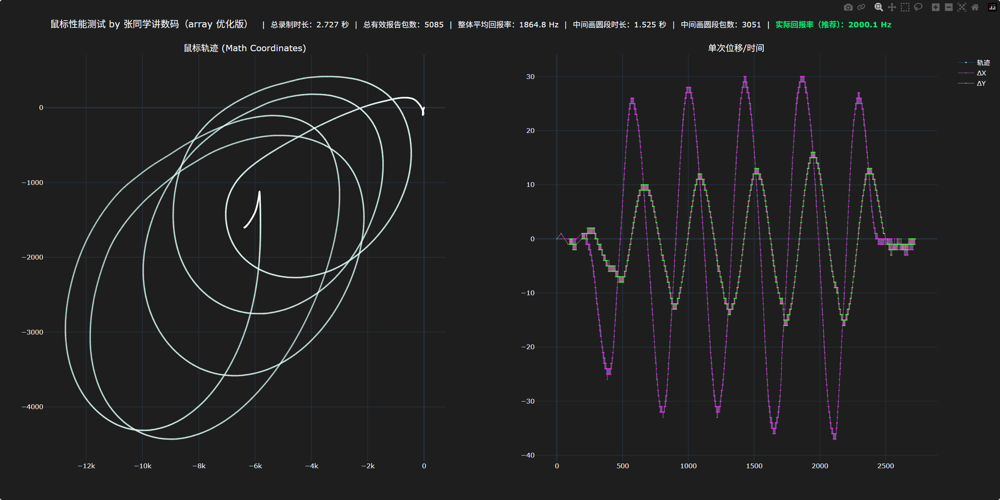

## 测试鼠标性能的工具

通过获取鼠标在电脑上的原始输入绘制图像，显示鼠标轨迹以及单次位移曲线，回报率数据

烈空f1 v3无线模式

ATK 蜻蜓A9 ultimate 无线模式

## 如何看自己鼠标性能

主要看鼠标单次位移

这是vxe的蜻蜓v3 pro无线模式下的画圆单次位移图，这鼠标主控是星闪，3395的传感器

有大幅度漂移的点说明鼠标有丢帧，主控的无线传输或者抗干扰比较一般

 

而单次位移如果在小幅度来回波动，说明鼠标跟手性不太好，即使插着数据线去用，单次位移依然会在小范围内波动

 

而下面是atk的蜻蜓a9大师版有线模式下的单次位移图

 

没有漂移点，因为是有线模式，不会像无线模式一样丢帧

单次位移不会在小范围波动，说明跟手性非常好

